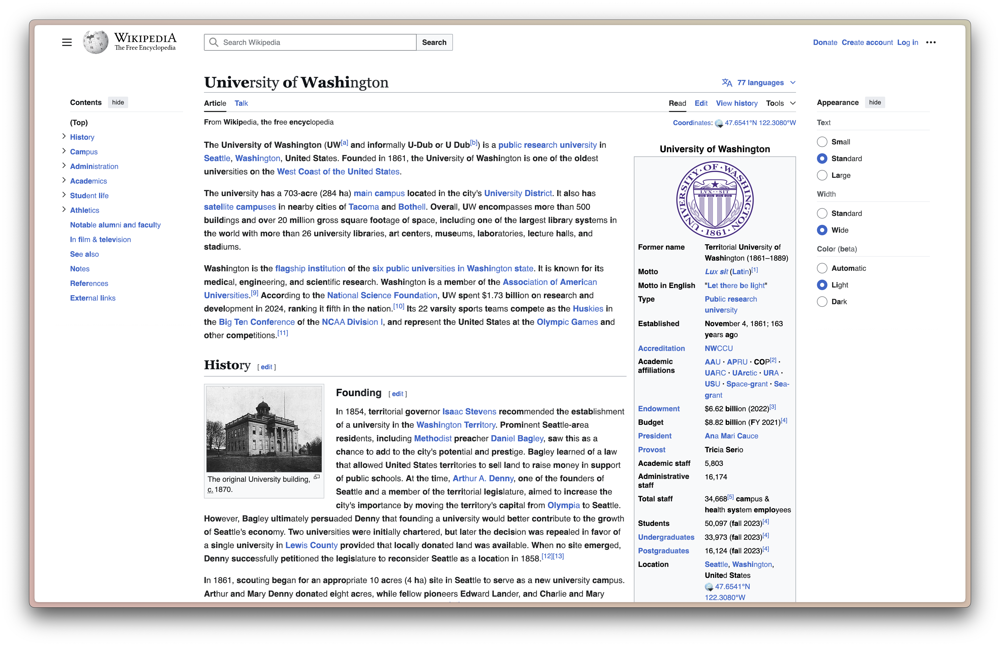
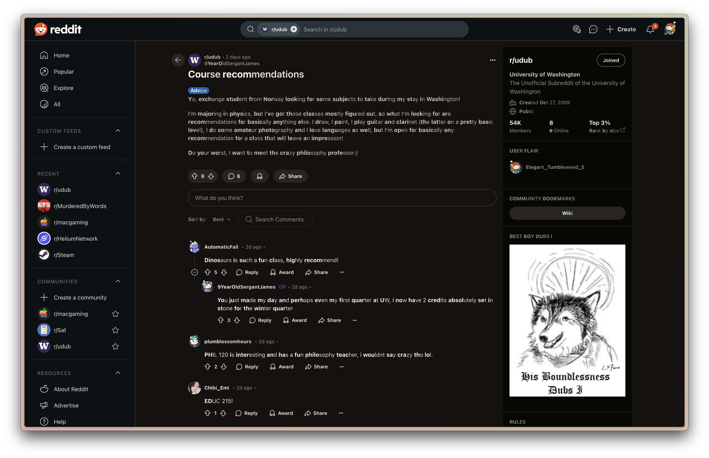

    
    

        <h1>Readify</h1>
        
A browser extension that enhances reading experience by applying bionic reading patterns to web content.

    

## Features

- Applies bionic reading patterns to improve reading speed and comprehension
- Automatically processes new content when the page is changed
- Smart detection of editable and interactive elements
- Performance optimized with progressive loading
- Configurable settings for bold intensity and word processing

## Showcase

    
    
    

## Installation

### Chrome Web Store

<a href="https://chromewebstore.google.com/detail/readify/agpjakbhkbidmhaejemhmlcdgdcopnij">
    
    Readify - Chrome Web Store
</a>

### Safari App Store

<a href="https://www.apple.com/app-store/">
    
    Readify - Safari App Store (Coming Soon)
</a>

### Build Safari Extension from Source

1. Clone the repository
2. Open `./apple-platform/Readify/Readify.xcodeproj` in Xcode
3. Select your development team in the project settings
4. Build and run the project
5. Enable the extension in Safari > Preferences > Extensions

### Manual Installation for Chromium-based Browsers

1. Download the latest release (.crx file) from the [Releases page](https://github.com/blueagler/readify/releases)
2. Open Chrome and go to `chrome://extensions/` or `edge://extensions/` for Microsoft Edge
3. Enable "Developer mode" in the top right corner
4. Drag and drop the downloaded .crx file into the extensions page

## Privacy

Please read our [Privacy Policy](PRIVACY.md) to understand how Readify handles your data.

## Changelog

See [CHANGELOG.md](CHANGELOG.md) for a list of changes and version history.
